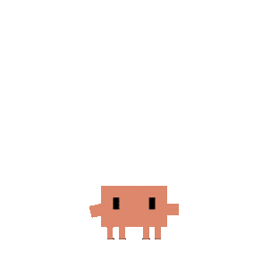
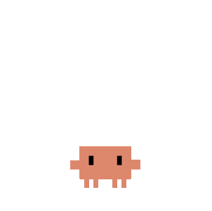
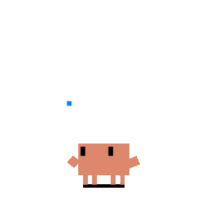
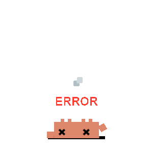
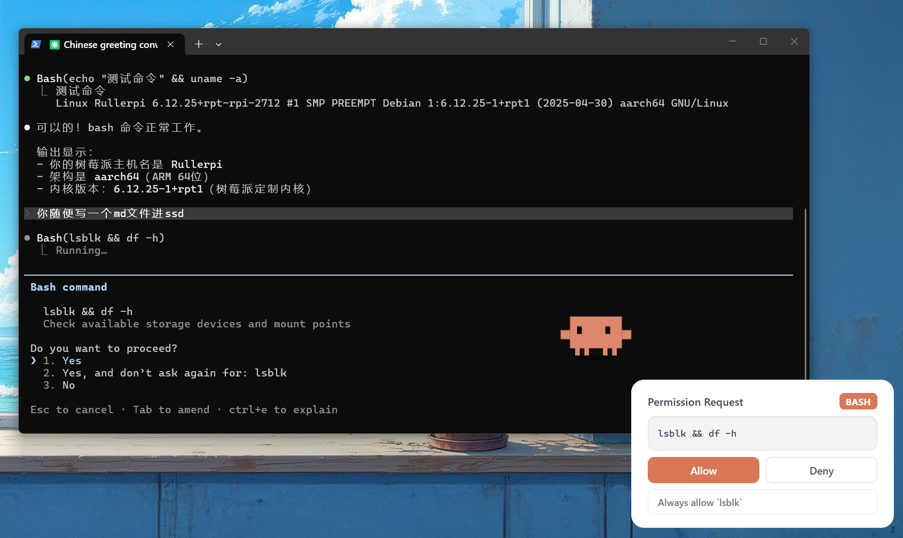

<p align="center">
  
</p>
<h1 align="center">clawd-on-desk-insights</h1>
<p align="center">
  一个带 RescueTime 风格分析面板和 AI 会话洞察能力的桌宠分支。
</p>
<p align="center">
  <a href="README.md">English</a>
</p>

这是基于 `rullerzhou-afk/clawd-on-desk` 的一个 fork，在保留实时桌宠反馈的基础上，增加了本地会话扫描与 AI 洞察层。它既能在屏幕上感知 Agent 的实时状态，也能回看本地对话历史，用 AI 总结每段会话想做什么、做成了什么，以及时间都花在了哪里。

> 支持 Windows 11、macOS 和 Ubuntu/Linux。需要 Node.js。支持 **Claude Code**、**Codex CLI**、**Copilot CLI**、**Gemini CLI** 与 **Cursor Agent**。

## 功能特性

### 洞察面板
- **RescueTime 风格时间线** — 按日期、项目、Agent、时长可视化查看会话分布
- **本地历史扫描** — 直接读取你机器上的 Claude Code、Codex CLI、Cursor Agent 对话文件
- **单会话 AI 复盘** — 从用户视角总结对话目标、成果、关键话题和时间分配
- **灵活分析后端** — 支持本地 Claude Code、本地 Codex，以及 API / Ollama 备选
- **批量预分析** — 可对最近会话批量生成摘要，并复用按 provider 隔离的缓存结果
- **快捷入口** — 可从托盘菜单打开分析面板，或使用 `Cmd/Ctrl+Shift+Alt+A`

### 多 Agent 支持
- **Claude Code** — 通过 command hook + HTTP 权限 hook 完整集成
- **Codex CLI** — 自动轮询 JSONL 日志（`~/.codex/sessions/`），无需配置
- **Copilot CLI** — 通过 `~/.copilot/hooks/hooks.json` 配置 command hook
- **Gemini CLI** — 通过 `~/.gemini/settings.json` 配置 command hook（Clawd 启动时自动注册，或执行 `npm run install:gemini-hooks`）
- **Cursor Agent** — [Cursor IDE hooks](https://cursor.com/docs/agent/hooks)，配置在 `~/.cursor/hooks.json`（Clawd 启动时自动注册，或执行 `npm run install:cursor-hooks`）
- **多 Agent 共存** — 多个 Agent 可同时运行，Clawd 独立追踪每个会话

### 动画与交互
- **实时状态感知** — 通过 Agent hook 和日志轮询自动驱动动画
- **12 种动画状态** — 待机、思考、打字、建造、杂耍、指挥、报错、开心、通知、扫地、搬运、睡觉
- **眼球追踪** — 待机状态下 Clawd 跟随鼠标，身体微倾，影子拉伸
- **睡眠序列** — 60 秒无活动 → 打哈欠 → 打盹 → 倒下 → 睡觉；移动鼠标触发惊醒弹起动画
- **点击反应** — 双击戳戳，连点 4 下东张西望
- **任意状态拖拽** — 随时抓起 Clawd（Pointer Capture 防止快甩丢失），松手恢复当前动画
- **极简模式** — 拖到右边缘或右键"极简模式"；Clawd 藏在屏幕边缘，悬停探头招手，通知/完成有迷你动画，抛物线跳跃过渡

### 权限审批气泡
- **桌面端权限审批** — Claude Code 请求工具权限时，Clawd 弹出浮动卡片，无需切回终端
- **允许 / 拒绝 / 建议** — 一键批准、拒绝，或应用权限规则（如"始终允许 Read"）
- **全局快捷键** — `Ctrl+Shift+Y` 允许、`Ctrl+Shift+N` 拒绝最新的权限气泡（仅在气泡可见时注册）
- **堆叠布局** — 多个权限请求从屏幕右下角向上堆叠
- **自动关闭** — 如果你先在终端回答了，气泡自动消失

### 会话智能
- **多会话追踪** — 多个 Claude Code 会话自动解析到最高优先级状态
- **子代理感知** — 1 个子代理杂耍，2 个以上指挥
- **终端聚焦** — 右键 Clawd → 会话菜单，一键跳转到对应会话的终端窗口；通知/注意状态自动聚焦相关终端
- **进程存活检测** — 检测已崩溃/退出的 Claude Code 进程，10 秒内清理孤儿会话
- **启动恢复** — 如果 Clawd 在 Claude Code 运行期间重启，会保持清醒等待 hook，而不是直接睡觉

### 系统
- **点击穿透** — 透明区域的点击直接穿透到下方窗口，只有角色本体可交互
- **位置记忆** — 重启后 Clawd 回到上次的位置（包括极简模式）
- **单实例锁** — 防止重复启动
- **自动启动** — Claude Code 的 SessionStart hook 可在 Clawd 未运行时自动拉起
- **免打扰模式** — 右键或托盘菜单进入休眠，所有 hook 事件静默，直到手动唤醒
- **提示音效** — 任务完成和权限请求时播放短音效（右键菜单可开关；10 秒冷却，免打扰模式自动静音）
- **系统托盘** — 调大小（S/M/L）、免打扰、语言切换、开机自启、检查更新
- **国际化** — 支持英文和中文界面，右键菜单或托盘切换
- **自动更新** — 检查 GitHub release；Windows 退出时安装 NSIS 更新包，macOS/Linux 源码运行时通过 `git pull` + 重启自动更新

## 状态映射

| Claude Code 事件 | 桌宠状态 | 动画 | |
|---|---|---|---|
| 无活动 | 待机 | 眼球跟踪 |  |
| 无活动（随机） | 待机 | 看书 |  |
| 无活动（随机） | 待机 | 侦探巡逻 |  |
| UserPromptSubmit | 思考 | 思考泡泡 |  |
| PreToolUse / PostToolUse | 工作（打字） | 打字 |  |
| PreToolUse（3+ 会话） | 工作（建造） | 建造 |  |
| SubagentStart（1 个） | 杂耍 | 杂耍 |  |
| SubagentStart（2+） | 指挥 | 指挥 |  |
| PostToolUseFailure / StopFailure | 报错 | ERROR + 冒烟 |  |
| Stop / PostCompact | 注意 | 开心蹦跳 |  |
| PermissionRequest / Notification | 通知 | 惊叹跳跃 |  |
| PreCompact | 扫地 | 扫帚清扫 |  |
| WorktreeCreate | 搬运 | 搬箱子 |  |
| 60 秒无事件 | 睡觉 | 睡眠序列 |  |

### 极简模式

将 Clawd 拖到屏幕右边缘（或右键 →"极简模式"）进入。Clawd 藏在屏幕边缘只露出半身，鼠标悬停时探出来招手。

| 触发 | 极简反应 | |
|---|---|---|
| 默认 | 呼吸 + 眨眼 + 偶尔手臂晃动 + 眼球追踪 |  |
| 鼠标悬停 | 探出身体 + 招手（向屏幕内侧滑出 25px） |  |
| 通知 / 权限请求 | 感叹号弹出 + >< 挤眼 |  |
| 任务完成 | 花花 + ^^ 眯眼 + 星星闪烁 |  |
| Peek 时点击 | 退出极简模式（抛物线跳回） | |

### 点击反应

彩蛋——试试双击、连点 4 下、或反复戳 Clawd，会有隐藏反应。

## 快速开始

```bash
# 克隆你的 fork
git clone https://github.com/yx0716/clawd-on-desk-insights.git
cd clawd-on-desk-insights

# 安装依赖
npm install

# 注册 Claude Code hooks（仅在确认版本兼容时注册 versioned hooks；版本未知时自动回退到核心 hooks 并清理旧的不兼容条目）
node hooks/install.js

# 启动 Clawd Insights
npm start
```

启动后可从托盘菜单打开分析面板，或使用 `Cmd/Ctrl+Shift+Alt+A`。

### Agent 配置

**Claude Code** — 开箱即用。应用启动时会自动注册 hooks。只有在确认 Claude Code 版本兼容时才会注册 versioned hooks；如果无法识别版本，会自动回退到核心 hooks 并清理旧的不兼容条目。

**Codex CLI** — 开箱即用。Clawd 会自动轮询 `~/.codex/sessions/`。

**Copilot CLI** — 需要手动配置 hooks，见 [docs/copilot-setup.md](docs/copilot-setup.md)。

### 洞察面板配置

分析面板是纯本地工作的，不依赖服务端。它会从以下目录读取本地历史：

- `~/.claude/projects/`
- `~/.codex/sessions/`
- `~/.cursor/projects/`

如果要生成 AI 会话摘要，应用会优先使用本地 `claude` 或 `codex` CLI；如果本地 CLI 不可用，也可以在应用里配置 API provider 或 Ollama 作为备选。

### 远程 SSH 模式（Claude Code & Codex CLI）



Clawd 支持通过 SSH 反向端口转发感知远程服务器上的 AI Agent 状态。Hook 事件和权限请求通过 SSH 隧道传回本地 Clawd，无需修改 Clawd 本体代码。

**一键部署：**

```bash
bash scripts/remote-deploy.sh user@远程主机
```

脚本会将 hook 文件复制到远程服务器，以远程模式注册 Claude Code hooks，并打印 SSH 配置指引。

**SSH 配置**（添加到本地 `~/.ssh/config`）：

```
Host my-server
    HostName 远程主机
    User user
    RemoteForward 127.0.0.1:23333 127.0.0.1:23333
    ServerAliveInterval 30
    ServerAliveCountMax 3
```

**工作原理：**
- **Claude Code** — 远程 hook 将状态 POST 到 `localhost:23333`，SSH 隧道转发回本地 Clawd。权限气泡也能正常弹出——HTTP 往返通过隧道完成。
- **Codex CLI** — 独立的日志监控脚本（`codex-remote-monitor.js`）在远程轮询 JSONL 文件，通过同一隧道 POST 状态变化。在远程启动：`node ~/.claude/hooks/codex-remote-monitor.js --port 23333`

远程 hook 以 `CLAWD_REMOTE` 模式运行，跳过 PID 采集（远程 PID 在本地无意义）。远程会话不支持终端聚焦。

> 感谢 [@Magic-Bytes](https://github.com/Magic-Bytes) 提出 SSH 隧道方案（[#9](https://github.com/rullerzhou-afk/clawd-on-desk/issues/9)）。

### 试用包分发

如果你想快速给同平台用户试用，可在本机直接打包：

```bash
npm run package:trial
```

产物会输出到 `dist/`。如果只想做本机冒烟测试或先发 `.app` 目录，可运行：

```bash
npm run package:trial:dir
```

### macOS 说明

- **源码运行**（`npm start`）：Intel 和 Apple Silicon 均可直接使用。
- **DMG 安装包**：未签名 Apple 开发者证书，macOS Gatekeeper 会拦截。解决方法：
  - 右键点击应用 → **打开** → 在弹窗中点击 **打开**，或
  - 在终端运行 `xattr -cr /Applications/Clawd\ on\ Desk\ Insights.app`

### Linux 说明

- **源码运行**（`npm start`）：自动传入 `--no-sandbox` 参数，跳过 chrome-sandbox SUID 校验。
- **安装包**：AppImage 和 `.deb` 可通过本仓库的 Releases 页面分发。deb 安装后应用图标会出现在 GNOME 应用菜单。
- **终端聚焦**：依赖 `wmctrl` 或 `xdotool`（有一个就行）。安装：`sudo apt install wmctrl` 或 `sudo apt install xdotool`。
- **自动更新**：源码运行时，"检查更新"会执行 `git pull` + `npm install`（依赖有变化时）并自动重启。

## 已知限制

| 限制 | 说明 |
|------|------|
| **Codex CLI：无法跳转终端** | Codex 通过 JSONL 日志轮询，日志中不含终端 PID，点击桌宠无法跳转到 Codex 终端。Claude Code 和 Copilot CLI 正常。 |
| **洞察扫描范围** | 当前分析面板只扫描 Claude Code、Codex CLI、Cursor Agent 的本地历史。Copilot CLI 和 Gemini CLI 仍会驱动桌宠状态，但暂未接入分析面板的历史扫描链路。 |
| **洞察摘要依赖总结后端** | AI 会话摘要需要本地 `claude` / `codex` CLI，或已配置的 API / Ollama。没有这些后端时，面板仍可展示时间线和基础会话信息。 |
| **Codex CLI：Windows hooks 禁用** | Codex 在 Windows 上硬编码禁用了 hooks，因此走日志轮询，延迟约 1.5 秒（hook 方式几乎无延迟）。 |
| **Copilot CLI：需手动配置 hooks** | Copilot 需要手动创建 `~/.copilot/hooks/hooks.json`。Claude Code 和 Codex 开箱即用。 |
| **Copilot CLI：无权限气泡** | Copilot 的 `preToolUse` 只支持拒绝，无法做完整的允许/拒绝审批流。权限气泡仅支持 Claude Code。 |
| **macOS/Linux 安装包自动更新** | DMG/AppImage/deb 安装包无法自动更新——使用 `git clone` + `npm start` 可通过 `git pull` 自动更新，或从 GitHub Releases 手动下载。 |
| **Electron 主进程无自动化测试** | 单元测试覆盖了 agent 配置和日志轮询，但状态机、窗口管理、托盘等 Electron 逻辑暂无自动化测试。 |

### 未来计划

一些我们想探索的方向：

- Codex 终端聚焦（通过 `codex.exe` PID 反查进程树）
- Copilot CLI hooks 自动注册（像 Claude Code 那样开箱即用）
- 自定义角色皮肤 / 动画
- Hook 卸载脚本（干净移除应用）

## 参与贡献

`clawd-on-desk-insights` 是一个社区驱动的 fork。欢迎提 Bug、提需求、提 PR —— 可直接在本仓库提 issue 或提交 PR。

### 贡献者

感谢每一位让 Clawd 变得更好的贡献者：

<a href="https://github.com/PixelCookie-zyf"></a>
<a href="https://github.com/yujiachen-y"></a>
<a href="https://github.com/AooooooZzzz"></a>
<a href="https://github.com/purefkh"></a>
<a href="https://github.com/Tobeabellwether"></a>
<a href="https://github.com/Jasonhonghh"></a>
<a href="https://github.com/crashchen"></a>
<a href="https://github.com/hongbigtou"></a>
<a href="https://github.com/InTimmyDate"></a>
<a href="https://github.com/NeizhiTouhu"></a>
<a href="https://github.com/xu3stones-cmd"></a>
<a href="https://github.com/Ye-0413"></a>
<a href="https://github.com/WanfengzzZ"></a>

## 致谢

- Clawd 像素画参考自 [clawd-tank](https://github.com/marciogranzotto/clawd-tank) by [@marciogranzotto](https://github.com/marciogranzotto)
- Clawd 角色设计归属 [Anthropic](https://www.anthropic.com)。本项目为非官方粉丝作品，与 Anthropic 无官方关联。本仓库中的角色美术素材不得用于商业用途。
- 本项目在 [LINUX DO](https://linux.do/) 社区推广

## 许可证

MIT
