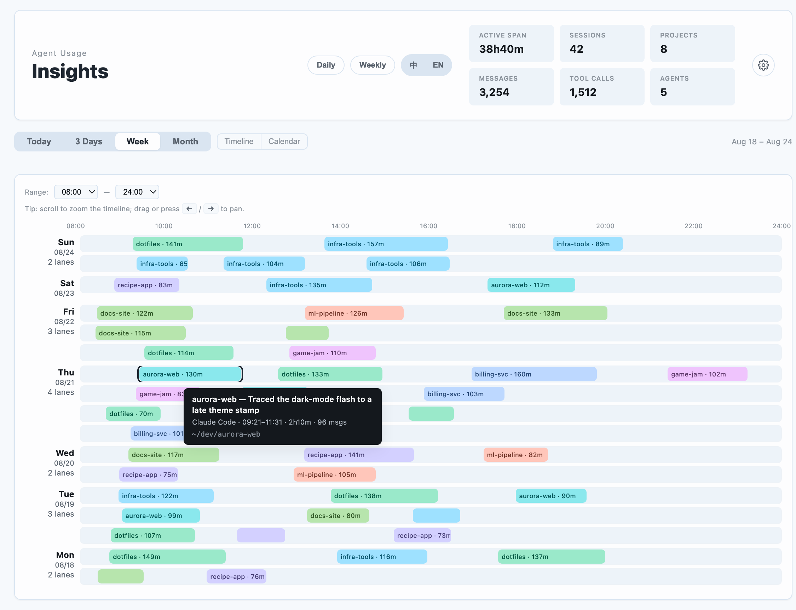
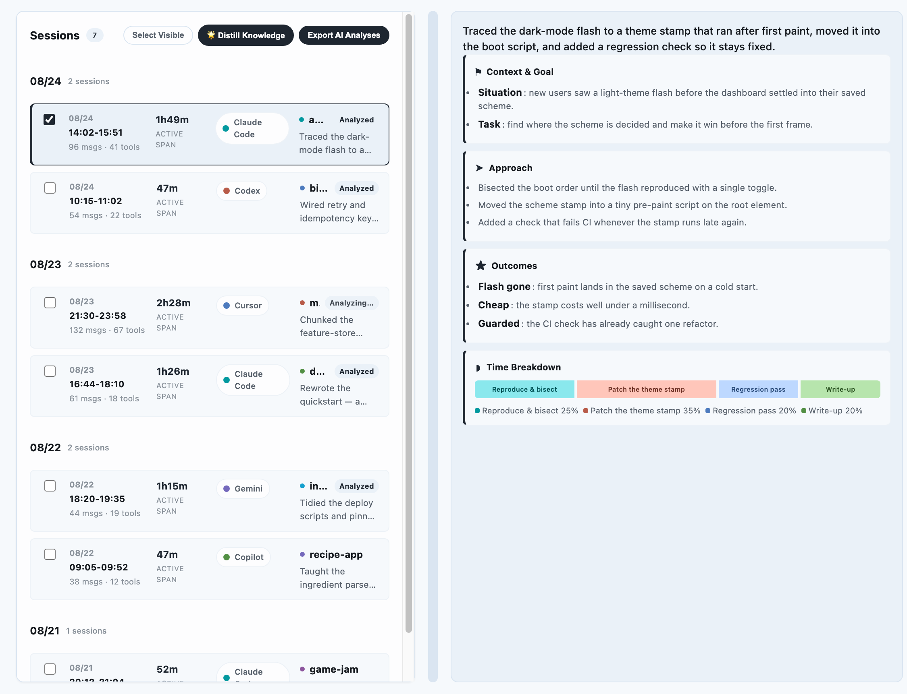
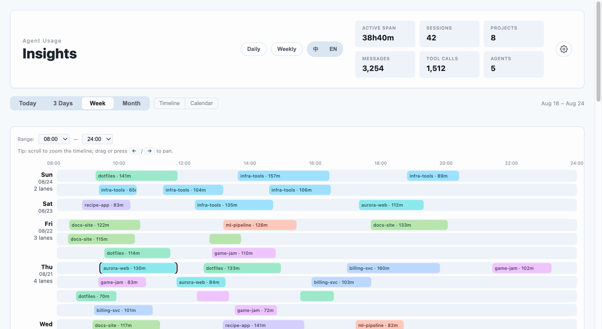
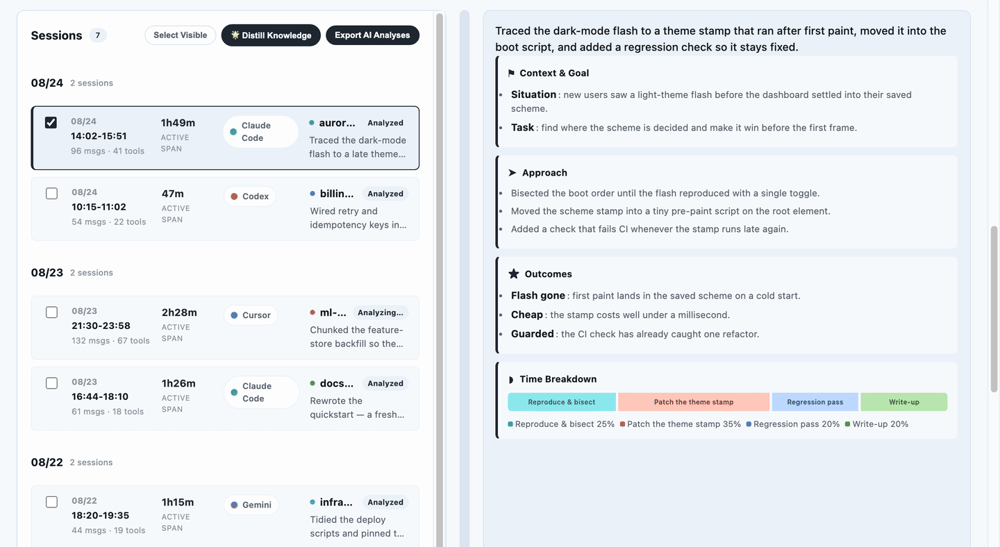

<div align="center">

# clawd-insights

**本地 Agent 会话分析与复盘面板**

> "你好clawd，该你写周报了"

[](#为什么需要它)
[](./LICENSE)
[-111827)](#上手指南)
[](#上手指南)
[](#项目渊源--致谢)

<p>
  <a href="#快速安装">安装</a> ·
  <a href="#功能特性">能力</a> ·
  <a href="#上手指南">上手</a> ·
  <a href="#它是怎么工作的">原理</a> ·
  <a href="#常见问题">FAQ</a> ·
  <a href="README.md">English</a>
</p>

</div>

<table align="center">
  <tr>
    <td width="50%" align="center" valign="top">
      
      <br /><sub><b>时间线视图</b> —— 每段会话的轨迹</sub>
    </td>
    <td width="50%" align="center" valign="top">
      
      <br /><sub><b>AI 会话复盘</b> —— 你的尝试和收获</sub>
    </td>
  </tr>
</table>


**这是 Agent 会话记录与复盘面板。** 它将自动扫描本地 **Claude Code、Codex、OpenClaw、tclaude、Cursor** 等 Agent 已进行的任务,生成对应时间线和会话智能分析摘要。如果你token 富足，还可以让他综合本地所有 agent 对话信息，生成你本周的工作汇报。

分析数据始终留在本地。会话分析会通过通过你本地 `claude` / `codex` CLI (或已配置的其他 API) 完成。会话分析不会被第三方获取。

> 现阶段主要支持 macOS。Windows/Linux 已初步适配，欢迎提供问题反馈。

## 快速安装

**方式一:命令行手动安装**

```bash
git clone https://github.com/yx0716/clawd-insights.git  # 获取源码
cd clawd-insights && npm install # 通过源码安装
npm start # 启动运行
```

**方式二:将 prompt 喂给你本地的 agent,让本地 agent完成安装**

懒得手动配环境？把下面整段复制进本地 agent 即可安装:

```text
帮我安装 clawd-insights(本地 agent 会话记录与复盘面板,仓库:https://github.com/yx0716/clawd-insights):
1. 先确认 git、node、npm 都可用;缺哪个就停下来告诉我怎么装,不要硬装。
2. 在合适的目录(默认 ~/clawd-insights,如果已存在先问我)执行:
   git clone https://github.com/yx0716/clawd-insights.git && cd clawd-insights && npm install
3. 启动 npm start。注意它是常驻的桌面应用,请用后台方式启动,不要在前台一直等它退出。
4. 启动后桌面上会出现一只像素小螃蟹,看到它就算安装成功。
5. 任何一步报错,把报错原文发给我,先说你的修复思路、经我确认再动手。
6. 最后告诉我:装在了哪个目录、下次怎么启动。
```

启动后桌面上出现一只小螃蟹——右键打开 **📊会话复盘面板**,即可开始使用。


## 功能特性

| 能力 | 说明 |
|---|---|
| **时间线视图** | 按日期 / 项目 / Agent使用 / 可视化所有会话。我们希望你能全局有清晰把握 |
| **日历视图切换** | 除时间线外，提供日历视图 |
| **本地历史扫描** | 获取本地会话记录(支持Claude Code / Claude Internal / tclaude / Codex / Cursor / OpenClaw / opencode / Gemini CLI / Qwen Code)等，不上传、无隐私风险 |
| **AI 会话复盘** | 从**用户视角**总结每段对话：你希望解决什么问题、AI 解决的交付结果，有哪些可以复用的技巧。我们支持速览、深入两档，后者将按 **STAR** 原则（情境-任务-行动-结果）进行结构化复盘 |
| **日报 / 周报** | 面板顶部，可对所选时间范围一键生成周报/日报 |
| **批量预分析** | 对最近会话批量预生成摘要,通过 provider 隔离的缓存支持复用 |
| **成本追踪** | 显示每次 AI 分析的 token 用量与费用 |

### 使用示例

<table align="center">
  <tr>
    <td width="25%" align="center" valign="top">
      
      <br /><sub><b>① 打开</b><br/>右键 → Dashboard</sub>
    </td>
    <td width="25%" align="center" valign="top">
      
      <br /><sub><b>② 选 Provider</b><br/>本地 CLI / API / Ollama</sub>
    </td>
    <td width="25%" align="center" valign="top">
      
      <br /><sub><b>③ 改设置</b><br/>齿轮 ⚙ → AI Provider</sub>
    </td>
    <td width="25%" align="center" valign="top">
      
      <br /><sub><b>④ 跑分析</b><br/>批量或按需点单条</sub>
    </td>
  </tr>
</table>

## 上手指南

### 1. 安装并启动

```bash
git clone https://github.com/yx0716/clawd-insights.git 
cd clawd-insights && npm install
npm start
```

启动后桌面右下角会出现一只小螃蟹，这是会话复盘的主入口。

### 2. 打开会话复盘面板

有三种方式可以打开洞察面板,选你顺手的:

- **右键点击桌面宠物** → 在弹出菜单中选 **📊会话复盘面板**
- **点击托盘图标**(macOS 顶部菜单栏) → **📊会话复盘面板**
- **快捷键**:macOS `⌘ + Shift + Option + A`

<p align="center">
  
</p>


### 3.配置会话分析模型, 启用会话只能复盘

会话时间线本身开箱即用，不需要额外操作。对 Agent 会话进行智能总结复盘，需要使用对应模型。提供分析能力的模型有以下三种配置选择：

| Provider 类型 | 是什么 | 怎么配置 | 适合谁 |
|---|---|---|---|
| **本地 CLI**(推荐) | 复用你已经装在电脑上的 `claude`(Claude Code)或 `codex` 命令行 | **不用额外配置**,面板会自动检测 | 已有 Claude Code / Codex / Cursor 订阅的朋友——使用订阅内的额度，无额外开销 |
| **API Key** | Anthropic、OpenAI 等服务商的 API key,按 token 计费 | 在面板设置里粘贴 key | 没装本地 CLI、又愿意为分析付一点 token 费用 |
| **Ollama** | 本地跑的开源模型服务(如 Ollama) | 在设置里填本地 endpoint | 想完全离线、不发送任何数据到云端 |

> **💡 强烈推荐**:如果你电脑上已经装了 Claude Code 或 Codex CLI ——面板会自动识别,直接复用你已有的订阅额度。是最省简单、性价比最高的方案方案。

如果后续希望更改分析模型提供方，可随时在设置中修改。
<p align="center">
  
</p>

一旦完成配置，可对需要复盘的会话、会话具体时间段内容（如果会话在时间周期较长，经历较多次间隔）进行分析。分析提供简要和深入两种版本。简要版将对会话进行 digest 概述，深入分析将按照 **STAR** 原则分析本地对话完成的任务，方便您进行项目复盘。

### 4. 开始 Agent 会话分析

#### 方法 A:批量预分析(开 Dashboard 时弹出)

每次打开 Analytics Dashboard,如果检测到有未分析的会话,面板会**自动弹出一个对话框** —— `Pre-analyze Sessions`, 一键启动开时间周期内所有会话分析。

可选范围:

- **Today** — 今天的所有会话
- **3 Days** — 最近三天
- **Week** — 最近一周
- **Custom** — 自定义最近 N 条

选好之后点确认,面板会显示 `Analyzing 1/N`、`2/N`...的进度条,后台将逐步完成。**已分析的会话会自动跳过**(按 provider 隔离的缓存), 重复点击不会浪费 token。

<p align="center">
  
</p>

#### 方法 B:点单条会话(timeline / sessions 列表里点击)

如果你**只想看某一个具体 session 的复盘**,不需要批量,可以直接点击:

- **从时间线点** — 在 Timeline 视图里,点击任意一个时间块(色块代表一段会话),右侧会跳出该 session 的详情卡片
- **从 sessions 列表点** — 右侧 Sessions 列表里,点击任意一张会话卡片

无论从哪里点,面板都会:

1. 优先显示**已缓存的摘要**(如果之前批量预分析过,会标 `Analyzed`,直接秒开)
2. 如果还没分析过,**点击会立即触发单条分析**,卡片显示 `Analyzing…` 标签,几秒到几十秒后出结果

<p align="center">
  
</p>

> **关于成本**:本地 CLI(Claude Code / Codex 订阅)分析**走你已有的订阅额度**,通常几乎不需要额外付费。API key 模式下,面板会在每条分析完成后**显示 token 用量和费用**(顶部状态栏),让你心里有数。

### 5. 修改会话分析模型配置

如果第 3 步跳过了，或者此后想更换 provider，可以通过 **AI Provider Settings** 进行调整:

打开 Analytics Dashboard → 点右上角的 **齿轮图标 ⚙** → 弹出 **AI Provider Settings** 面板。

<p align="center">
  
</p>


- **LOCAL CLI DETECTION**(本地 CLI 自动检测) — 显示面板有没有找到你本地的 `claude` 和 `codex`。绿点 = 找到了,显示版本号和路径;红点 = 没找到。**已显示绿点说明一切正常，可以直接进行下一步**。
- **API PROVIDER (FALLBACK)**(API 备选) — 如果未安装本地 CLI，可以通过 API Key 进行 会话智能分析(Claude / OpenAI / Ollama 等)、粘贴 API key 即可。

> **小提示**:如果你的 `claude` / `codex` 是通过 NVM、fnm、Volta 这类版本管理工具装的,自动检测可能找不到。这时候在终端执行 `which claude` 或 `which codex`,把输出的路径粘贴到上面的 **Claude binary path** / **Codex binary path** 输入框里就行。

### 使用前自检

1. 已在本地使用 `Claude Code`、`Codex` 或 `Cursor Agent`，且当前仍可使用
2. 本地有会话记录 （默认存在）

**快速检查**

- 打开设置,看 `Local CLI Detection`
- 切到 `Week` 或 `Month` 看 timeline 里是否有 session

## 它是怎么工作的

Clawd 同时跑着两条互不依赖的数据通路:

```
你的 Agent                            Clawd
  │                                    │
  ├── 实时事件 ──→ hook / 轮询 / 插件 ──→ 🦀 桌面宠物动画
  │                                    │
  └── 对话历史 ──→ 本地 JSONL 文件 ────→ 📊 会话复盘面板
```

### 通路 ①:实时感知 → 桌宠动画

Agent runtime(调用工具、等待用户输入、报错、完成任务……)会产生事件。Clawd 通过三种方式捕获这些事件,驱动桌面宠物播放对应动画:

| 集成方式 | 原理 | 延迟 | 使用的 Agent |
|---|---|---|---|
| **Command hook** | Agent 触发事件时自动执行一段脚本,脚本通过 HTTP POST 将事件发给 Clawd 本地服务器(`127.0.0.1:23333`) | 近乎零 | Claude Code、Claude Internal、tclaude、Copilot CLI、Gemini CLI、Cursor Agent、Kiro CLI、Antigravity CLI、CodeBuddy、Kimi CLI |
| **日志轮询** | Clawd 每 ~1.5 秒扫描 Agent 写入的 JSONL 日志文件,检测新事件 | ~1.5 秒 | Codex CLI、Gemini CLI(备选)、Kimi CLI(备选) |
| **In-process 插件** | 插件直接跑在 Agent 进程内部,零开销转发事件 | 零 | opencode、openclaw、Hermes、Pi |

所有 Agent 的事件最终都映射到同一套状态机:`idle → thinking → working → happy / error → sleeping`。桌面宠物根据当前状态播放对应的 SVG 动画,多个会话同时运行时自动切换到 juggling(杂耍)/ building(建造)/ conducting(指挥)动画。

> **多 Agent 共存**:Claude Code、Claude Internal、tclaude、Codex、Copilot、Gemini、Cursor、Kiro、opencode、Antigravity CLI、CodeBuddy、Hermes、Kimi CLI、openclaw、Pi 可以同时运行。Clawd 为每个 session 独立维护状态,取最高优先级作为桌面宠物当前显示。

### 通路 ②:离线分析 → 洞察面板

你和 Agent 的每次对话都会以 JSONL 格式保存在本地:

| Agent | 本地历史路径 |
|---|---|
| Claude Code | `~/.claude/projects/` |
| Claude Internal | `~/.claude-internal/projects/` |
| tclaude | `~/.tclaude/projects/` |
| Codex CLI | `~/.codex/sessions/` |
| Cursor Agent | `~/.cursor/projects/` |

洞察面板直接读这些文件,生成时间线和 AI 摘要。**不走 hooks,不依赖小clawd运行**——即使你从没启动过桌面宠物,只要本地有对话历史,面板就能工作。

> **注**:目前分析面板的扫描器只覆盖上面四个 Agent。Copilot CLI、Gemini CLI、Kiro CLI、opencode 仍能驱动桌面宠物动画,但它们的本地历史尚未接入面板扫描链路。

## 桌宠能力(与上游同步)

除了分析层之外,本 fork 现在与 [`clawd-on-desk`](https://github.com/rullerzhou-afk/clawd-on-desk) 完整同步,纳入了它的全部桌宠能力:

- **更广的 Agent 支持** —— 像素动画覆盖 **Claude Code、Claude Internal、tclaude、Codex CLI、Copilot CLI、Gemini CLI、Cursor Agent、Kiro CLI、opencode**,以及新合入的 **Antigravity CLI、CodeBuddy、Hermes、Kimi CLI、openclaw、Pi**。
- **WSL 与远程开发**(本次同步重点)—— Codex 官方支持 **WSL2**,Clawd 通过 Codex 官方 hooks 集成(JSONL 轮询作为兜底)。当 Agent 跑在远程主机或 WSL 独立的 Linux home 里时,**远程 SSH** 会通过 SSH 隧道把 hooks 部署过去,让桌宠也能感知这些会话;远程端必须使用 POSIX shell —— **Git Bash 或 WSL `bash`,而不是 Windows `cmd.exe`**。详见 [docs/guides/codex-wsl-clarification.zh-CN.md](docs/guides/codex-wsl-clarification.zh-CN.md) 与 [docs/guides/setup-guide.zh-CN.md](docs/guides/setup-guide.zh-CN.md)。
- **图形化设置面板** —— 完整的设置窗口(Agent、主题、快捷键、远程 SSH、Telegram 审批),不必再手改配置文件。
- **主题系统** —— 把螃蟹换成其他角色(如 Cloudling 主题),或用 `npm run create-theme` 自建主题。
- **经典能力** —— 权限气泡、极简模式、点击反应、眼球追踪、睡眠序列、多显示器支持全部保留。

平台相关说明(Windows 终端聚焦、macOS 聚焦、已知限制)见 [docs/guides/](docs/guides/)。

## 常见问题

**Q:面板需要联网吗?**
扫描和时间线**完全离线**。AI 摘要要不要联网取决于你选的 provider:本地 CLI 用 Claude Code / Codex 时会走它们各自的网络栈;Ollama 完全离线;API key 模式才会走云端。

**Q:我的对话内容会被上传吗?**
不会。Clawd Insights 不收集任何遥测数据。Provider 这一步是"你的 CLI / 你的 API key 直接调你选的模型",中间没有第三方服务器。

**Q:我没有 Claude Code 也没有 Codex,能用吗?**
可以。你可以只用时间线视图(完全免费、不需要任何 LLM),或者在 AI Provider Settings 里填一个 Anthropic / OpenAI API key 走云端模式。

## 参与贡献

Clawd Insights 是一个社区驱动的 fork。欢迎 bug 反馈、功能想法和 pull request——开一个 [issue](https://github.com/yx0716/clawd-insights/issues) 来讨论,或者直接提 PR。

致谢名单分成两部分:建设**本 fork**(分析层及上文列出的一切)的人,以及本 fork 所依托的桌宠背后的**上游社区**。

### 贡献者

感谢每一位为本 fork 做出贡献的人:

<table>
  <tr>
    <td align="center" valign="top" width="110"><a href="https://github.com/yx0716"><br /><sub>yx0716</sub></a></td>
    <td align="center" valign="top" width="110"><a href="https://github.com/kingsley-wade"><br /><sub>kingsley-wade</sub></a></td>
    <td align="center" valign="top" width="110"><a href="https://github.com/dopawei"><br /><sub>dopawei</sub></a></td>
    <td align="center" valign="top" width="110"><a href="https://github.com/XingLiu1"><br /><sub>XingLiu1</sub></a></td>
  </tr>
</table>

### 上游 · clawd-on-desk

底下这只桌宠——动画、权限气泡、多 Agent 追踪、主题系统等等——是 [`clawd-on-desk`](https://github.com/rullerzhou-afk/clawd-on-desk) 社区的工作成果。下面的名单搬运自上游 README(快照时间:2026 年 7 月);权威、随时更新的名单以[上游仓库](https://github.com/rullerzhou-afk/clawd-on-desk#contributing)为准。

#### 维护者

<table>
  <tr>
    <td align="center" valign="top" width="140"><a href="https://github.com/rullerzhou-afk"><br /><sub><b>@rullerzhou-afk</b><br />鹿鹿 · creator</sub></a></td>
    <td align="center" valign="top" width="140"><a href="https://github.com/YOIMIYA66"><br /><sub><b>@YOIMIYA66</b><br />maintainer</sub></a></td>
    <td align="center" valign="top" width="140"><a href="https://github.com/Bynlk"><br /><sub><b>@Bynlk</b><br />core contributor · Mobile / PWA</sub></a></td>
  </tr>
</table>

#### 贡献者

感谢每一位让 Clawd 变得更好的人:

<table>
  <tr>
    <td align="center" valign="top" width="110"><a href="https://github.com/PixelCookie-zyf"><br /><sub>PixelCookie-zyf</sub></a></td>
    <td align="center" valign="top" width="110"><a href="https://github.com/yujiachen-y"><br /><sub>yujiachen-y</sub></a></td>
    <td align="center" valign="top" width="110"><a href="https://github.com/AooooooZzzz"><br /><sub>AooooooZzzz</sub></a></td>
    <td align="center" valign="top" width="110"><a href="https://github.com/purefkh"><br /><sub>purefkh</sub></a></td>
    <td align="center" valign="top" width="110"><a href="https://github.com/Tobeabellwether"><br /><sub>Tobeabellwether</sub></a></td>
    <td align="center" valign="top" width="110"><a href="https://github.com/Jasonhonghh"><br /><sub>Jasonhonghh</sub></a></td>
    <td align="center" valign="top" width="110"><a href="https://github.com/crashchen"><br /><sub>crashchen</sub></a></td>
  </tr>
  <tr>
    <td align="center" valign="top" width="110"><a href="https://github.com/hongbigtou"><br /><sub>hongbigtou</sub></a></td>
    <td align="center" valign="top" width="110"><a href="https://github.com/InTimmyDate"><br /><sub>InTimmyDate</sub></a></td>
    <td align="center" valign="top" width="110"><a href="https://github.com/NeizhiTouhu"><br /><sub>NeizhiTouhu</sub></a></td>
    <td align="center" valign="top" width="110"><a href="https://github.com/xu3stones-cmd"><br /><sub>xu3stones-cmd</sub></a></td>
    <td align="center" valign="top" width="110"><a href="https://github.com/androidZzT"><br /><sub>androidZzT</sub></a></td>
    <td align="center" valign="top" width="110"><a href="https://github.com/Ye-0413"><br /><sub>Ye-0413</sub></a></td>
    <td align="center" valign="top" width="110"><a href="https://github.com/WanfengzzZ"><br /><sub>WanfengzzZ</sub></a></td>
  </tr>
  <tr>
    <td align="center" valign="top" width="110"><a href="https://github.com/TaoXieSZ"><br /><sub>TaoXieSZ</sub></a></td>
    <td align="center" valign="top" width="110"><a href="https://github.com/ssly"><br /><sub>ssly</sub></a></td>
    <td align="center" valign="top" width="110"><a href="https://github.com/stickycandy"><br /><sub>stickycandy</sub></a></td>
    <td align="center" valign="top" width="110"><a href="https://github.com/Rladmsrl"><br /><sub>Rladmsrl</sub></a></td>
    <td align="center" valign="top" width="110"><a href="https://github.com/YOIMIYA66"><br /><sub>YOIMIYA66</sub></a></td>
    <td align="center" valign="top" width="110"><a href="https://github.com/Kevin7Qi"><br /><sub>Kevin7Qi</sub></a></td>
    <td align="center" valign="top" width="110"><a href="https://github.com/sefuzhou770801-hub"><br /><sub>sefuzhou770801-hub</sub></a></td>
  </tr>
  <tr>
    <td align="center" valign="top" width="110"><a href="https://github.com/Tonic-Jin"><br /><sub>Tonic-Jin</sub></a></td>
    <td align="center" valign="top" width="110"><a href="https://github.com/seoki180"><br /><sub>seoki180</sub></a></td>
    <td align="center" valign="top" width="110"><a href="https://github.com/sophie-haynes"><br /><sub>sophie-haynes</sub></a></td>
    <td align="center" valign="top" width="110"><a href="https://github.com/PeterShanxin"><br /><sub>PeterShanxin</sub></a></td>
    <td align="center" valign="top" width="110"><a href="https://github.com/CHIANGANGSTER"><br /><sub>CHIANGANGSTER</sub></a></td>
    <td align="center" valign="top" width="110"><a href="https://github.com/JaeHyeon-KAIST"><br /><sub>JaeHyeon-KAIST</sub></a></td>
    <td align="center" valign="top" width="110"><a href="https://github.com/hhhzxyhhh"><br /><sub>hhhzxyhhh</sub></a></td>
  </tr>
  <tr>
    <td align="center" valign="top" width="110"><a href="https://github.com/TVpoet"><br /><sub>TVpoet</sub></a></td>
    <td align="center" valign="top" width="110"><a href="https://github.com/zeus6768"><br /><sub>zeus6768</sub></a></td>
    <td align="center" valign="top" width="110"><a href="https://github.com/anhtrinh919"><br /><sub>anhtrinh919</sub></a></td>
    <td align="center" valign="top" width="110"><a href="https://github.com/tomaioo"><br /><sub>tomaioo</sub></a></td>
    <td align="center" valign="top" width="110"><a href="https://github.com/v-avuso"><br /><sub>v-avuso</sub></a></td>
    <td align="center" valign="top" width="110"><a href="https://github.com/livlign"><br /><sub>livlign</sub></a></td>
    <td align="center" valign="top" width="110"><a href="https://github.com/tongguang2"><br /><sub>tongguang2</sub></a></td>
  </tr>
  <tr>
    <td align="center" valign="top" width="110"><a href="https://github.com/Ziy1-Tan"><br /><sub>Ziy1-Tan</sub></a></td>
    <td align="center" valign="top" width="110"><a href="https://github.com/tatsuyanakanogaroinc"><br /><sub>tatsuyanakanogaroinc</sub></a></td>
    <td align="center" valign="top" width="110"><a href="https://github.com/yeonhub"><br /><sub>yeonhub</sub></a></td>
    <td align="center" valign="top" width="110"><a href="https://github.com/joshua-wu"><br /><sub>joshua-wu</sub></a></td>
    <td align="center" valign="top" width="110"><a href="https://github.com/nmsn"><br /><sub>nmsn</sub></a></td>
    <td align="center" valign="top" width="110"><a href="https://github.com/sunnysonx"><br /><sub>sunnysonx</sub></a></td>
    <td align="center" valign="top" width="110"><a href="https://github.com/YuChenYunn"><br /><sub>YuChenYunn</sub></a></td>
  </tr>
  <tr>
    <td align="center" valign="top" width="110"><a href="https://github.com/jhseo-b"><br /><sub>jhseo-b</sub></a></td>
    <td align="center" valign="top" width="110"><a href="https://github.com/Hwasowl"><br /><sub>Hwasowl</sub></a></td>
    <td align="center" valign="top" width="110"><a href="https://github.com/XiangZheng2002"><br /><sub>XiangZheng2002</sub></a></td>
    <td align="center" valign="top" width="110"><a href="https://github.com/keiyo118"><br /><sub>keiyo118</sub></a></td>
    <td align="center" valign="top" width="110"><a href="https://github.com/pan93412"><br /><sub>pan93412</sub></a></td>
    <td align="center" valign="top" width="110"><a href="https://github.com/taehwanis"><br /><sub>taehwanis</sub></a></td>
    <td align="center" valign="top" width="110"><a href="https://github.com/linnin233"><br /><sub>linnin233</sub></a></td>
  </tr>
  <tr>
    <td align="center" valign="top" width="110"><a href="https://github.com/xiyouMc"><br /><sub>xiyouMc</sub></a></td>
    <td align="center" valign="top" width="110"><a href="https://github.com/Bynlk"><br /><sub>Bynlk</sub></a></td>
    <td align="center" valign="top" width="110"><a href="https://github.com/zxypro1"><br /><sub>zxypro1</sub></a></td>
    <td align="center" valign="top" width="110"><a href="https://github.com/NeroAyase"><br /><sub>NeroAyase</sub></a></td>
    <td align="center" valign="top" width="110"><a href="https://github.com/divergentD"><br /><sub>divergentD</sub></a></td>
    <td align="center" valign="top" width="110"><a href="https://github.com/Ne9roni"><br /><sub>Ne9roni</sub></a></td>
    <td align="center" valign="top" width="110"><a href="https://github.com/QingXB"><br /><sub>QingXB</sub></a></td>
  </tr>
  <tr>
    <td align="center" valign="top" width="110"><a href="https://github.com/29206394"><br /><sub>藤知</sub></a></td>
    <td align="center" valign="top" width="110"><a href="https://github.com/Tsdsj"><br /><sub>Tsdsj</sub></a></td>
    <td align="center" valign="top" width="110"><a href="https://github.com/godlockin"><br /><sub>godlockin</sub></a></td>
    <td align="center" valign="top" width="110"><a href="https://github.com/sLingli"><br /><sub>sLingli</sub></a></td>
    <td align="center" valign="top" width="110"><a href="https://github.com/ustin-star"><br /><sub>ustin-star</sub></a></td>
    <td align="center" valign="top" width="110"><a href="https://github.com/cod3hulk"><br /><sub>cod3hulk</sub></a></td>
    <td align="center" valign="top" width="110"><a href="https://github.com/lxgxhsy"><br /><sub>lxgxhsy</sub></a></td>
  </tr>
  <tr>
    <td align="center" valign="top" width="110"><a href="https://github.com/rebootcrab-blip"><br /><sub>rebootcrab-blip</sub></a></td>
    <td align="center" valign="top" width="110"><a href="https://github.com/zhaoxv210"><br /><sub>zhaoxv210</sub></a></td>
    <td align="center" valign="top" width="110"><a href="https://github.com/serenNan"><br /><sub>serenNan</sub></a></td>
    <td align="center" valign="top" width="110"><a href="https://github.com/IatomicreactorI"><br /><sub>IatomicreactorI</sub></a></td>
    <td align="center" valign="top" width="110"><a href="https://github.com/quantai1314"><br /><sub>quantai1314</sub></a></td>
    <td align="center" valign="top" width="110"><a href="https://github.com/Git-creat7"><br /><sub>Git-creat7</sub></a></td>
    <td align="center" valign="top" width="110"><a href="https://github.com/undownding"><br /><sub>undownding</sub></a></td>
  </tr>
  <tr>
    <td align="center" valign="top" width="110"><a href="https://github.com/chrono-meta"><br /><sub>chrono-meta</sub></a></td>
    <td align="center" valign="top" width="110"><a href="https://github.com/Yike-Ye"><br /><sub>Yike-Ye</sub></a></td>
    <td align="center" valign="top" width="110"><a href="https://github.com/xiaoshidefeng"><br /><sub>xiaoshidefeng</sub></a></td>
    <td align="center" valign="top" width="110"><a href="https://github.com/yanguibao1997"><br /><sub>yanguibao1997</sub></a></td>
    <td align="center" valign="top" width="110"><a href="https://github.com/JasonZH6600"><br /><sub>JasonZH6600</sub></a></td>
    <td align="center" valign="top" width="110"><a href="https://github.com/V1staz"><br /><sub>V1staz</sub></a></td>
    <td align="center" valign="top" width="110"><a href="https://github.com/royhuang91"><br /><sub>royhuang91</sub></a></td>
  </tr>
  <tr>
    <td align="center" valign="top" width="110"><a href="https://github.com/Schlaflied"><br /><sub>Schlaflied</sub></a></td>
    <td align="center" valign="top" width="110"><a href="https://github.com/KaiC5504"><br /><sub>KaiC5504</sub></a></td>
  </tr>
</table>

## 项目渊源 & 致谢

Clawd Insights 是构建在 [`rullerzhou-afk/clawd-on-desk`](https://github.com/rullerzhou-afk/clawd-on-desk) 之上的**洞察分析层**——上游是一只把 coding agent 状态变成像素画的可爱桌面宠物,所有让它讨喜的部分(动画、权限气泡、多 Agent 状态追踪、极简模式等等)都被原封不动地保留了下来。这个 fork 多问了一件事:**如果你和 Agent 的每一次对话,都能被搜索、被总结、汇集到同一块面板上,会怎样?**

这块面板就是新增的核心。它扫描你的本地历史记录(目前覆盖 Claude Code、Claude Internal、tclaude、Codex CLI、Cursor Agent,更多 agent 接入中),画出时间线,再让你自选的 LLM 为每一次会话生成摘要——全程不向任何第三方发送一个字节。

从上游继承的多 Agent 状态追踪,并且本仓库现在与上游完整代码保持同步(WSL 与远程 SSH 支持、扩充的 Agent 阵容、图形化设置面板、主题系统、Telegram 审批、Doctor 诊断等)。桌面宠物本身的完整功能请见上方 [桌宠能力(与上游同步)](#桌宠能力与上游同步)。

特别感谢 [@rullerzhou-afk](https://github.com/rullerzhou-afk) 和所有共同塑造原版 Clawd 的贡献者——没有这份基础,就没有这个项目。完整的致谢名单(fork 与上游并列)见上方[参与贡献](#参与贡献)。

## 许可证

源代码:[GNU AGPL-3.0-only 许可证](LICENSE) —— 沿用自上游 `clawd-on-desk`(本仓库已纳入其代码)。第三方素材另见 [NOTICE.md](NOTICE.md)。

**美术素材(assets/)不适用 AGPL 许可。** 所有权利归各自版权持有人所有,详见 [assets/LICENSE](assets/LICENSE)。

- **Clawd** 角色设计归属 [Anthropic](https://www.anthropic.com)。本项目为非官方粉丝作品,与 Anthropic 无官方关联。
- **三花猫** 素材由 鹿鹿 ([@rullerzhou-afk](https://github.com/rullerzhou-afk)) 创作,保留所有权利。
- **第三方画师作品**:版权归各自作者所有。
